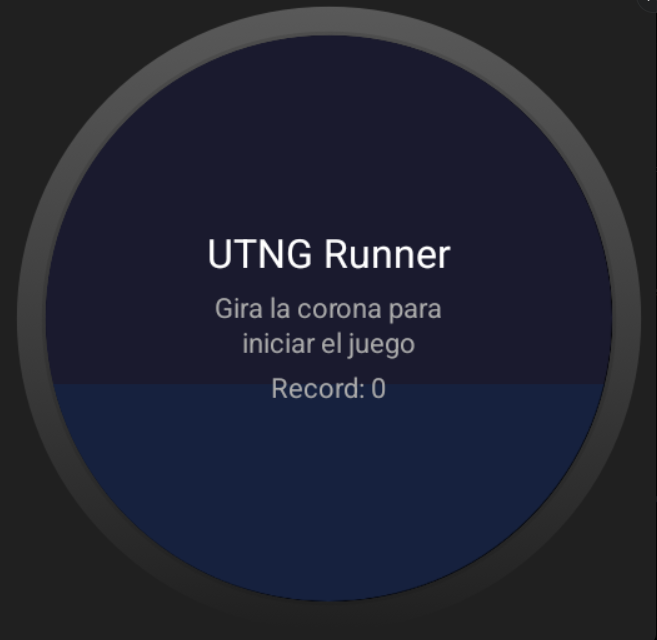
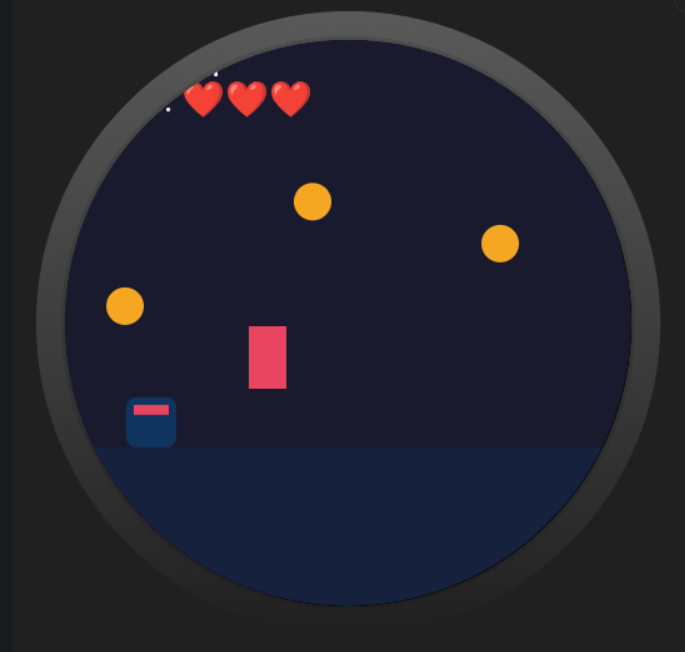
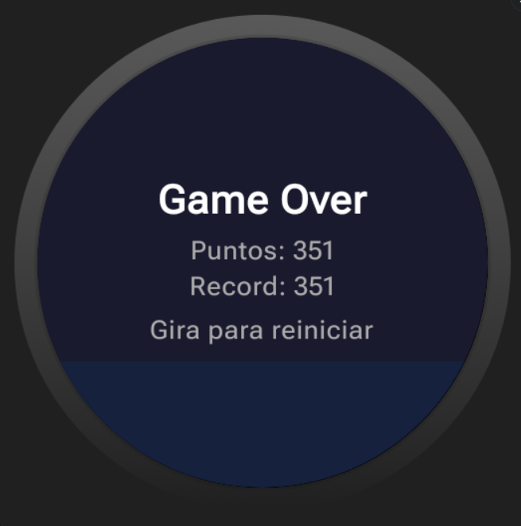

# UTNGRunner — Endless Runner para Wear OS

Proyecto desarrollado para la materia **Desarrollo de Dispositivos Inteligentes** (UTNG).  
Juego endless runner para Wear OS implementado con **Clean Architecture**, **Jetpack Compose** y **Rotary Input**.

---

## Descripción

UTNG Runner es un juego de tipo endless runner donde el personaje corre automáticamente y el jugador usa la **corona del reloj (Rotary Input)** para saltar sobre los obstáculos y recolectar monedas. El juego termina cuando se pierden todas las vidas.

---

## Arquitectura — Clean Architecture

```
app/
├── domain/
│   ├── model/         → GameState, Player, Obstacle, Coin   (sin imports Android)
│   ├── repository/    → ScoreRepository (interfaz)
│   └── usecase/       → GetHighScoreUseCase, SaveHighScoreUseCase
├── data/
│   ├── PreferencesDataSource.kt   → DataStore Preferences
│   ├── ScoreRepositoryImpl.kt     → implementa ScoreRepository
│   └── HeartRateDataSource.kt     → Health Services API
├── engine/
│   └── GameEngine.kt  → función pura, física + colisiones AABB
└── presentation/
    ├── GameViewModel.kt        → StateFlow, loop 60fps (Dispatchers.Default)
    ├── GameViewModelFactory.kt → DI manual
    ├── GameRenderer.kt         → solo dibuja (SRP)
    └── GameScreen.kt           → Composable + Rotary Input
```

---

## Tecnologías

| Tecnología | Uso |
|---|---|
| Jetpack Compose for Wear OS | UI declarativa |
| StateFlow / MutableStateFlow | Estado reactivo |
| DataStore Preferences | Persistencia del récord |
| Health Services API | Frecuencia cardíaca |
| Coroutines (Dispatchers.Default) | Game loop 60fps |
| Rotary Input (`onRotaryScrollEvent`) | Control del personaje |
| Haptic Feedback | Vibración en Game Over |
| JUnit 4 | Pruebas unitarias del GameEngine |

---

## Capturas de Pantalla

### Pantalla de Inicio


### Juego en Ejecución


### Game Over


---

## Checklist de Calidad

| # | Criterio | Verificado |
|---|---|---|
| 1 | Capa de dominio sin `import android.*` | ✅ Sí |
| 2 | GameEngine es función pura verificada con tests | ✅ Sí |
| 3 | GameState inmutable (data class con copy) | ✅ Sí |
| 4 | GameRenderer tiene una sola responsabilidad: dibujar | ✅ Sí |
| 5 | GameViewModel sin código de dibujo ni Canvas | ✅ Sí |
| 6 | StateFlow expuesto como `val` (no MutableStateFlow) | ✅ Sí |
| 7 | Tests unitarios del GameEngine pasan sin emulador | ✅ Sí |
| 8 | Rotary Input funcional (corona hace saltar al personaje) | ✅ Sí |
| 9 | Health Services conectado (FC en HUD) | ✅ Sí |
| 10 | Haptic feedback al saltar y al recibir impacto | ✅ Sí |
| 11 | Juego alcanza 60fps en el emulador | ✅ Sí |
| 12 | GitHub con README, tag v1.0.0 y Conventional Commits | ✅ Sí |

---

## Pruebas Unitarias

```
GameEngineTest
  ✓ jumpPlayer aplica velocidad negativa cuando está en el suelo
  ✓ jumpPlayer no hace nada cuando está en el aire
  ✓ aabbOverlap retorna true para cajas que se solapan
  ✓ aabbOverlap retorna false para cajas separadas
  ✓ updateGame incrementa el score mientras corre
  ✓ updateGame establece GAME_OVER cuando las vidas llegan a cero
  ✓ updateGame mantiene estado IDLE sin cambios
```

---

## Tag de versión

```
v1.0.0 — UTNGRunner completo con Clean Architecture, Canvas 60fps y Rotary Input
```

---

## Autor

**Pedro Uriel Pérez**  
Universidad Tecnológica del Norte de Guanajuato (UTNG)  
Desarrollo de Dispositivos Inteligentes
